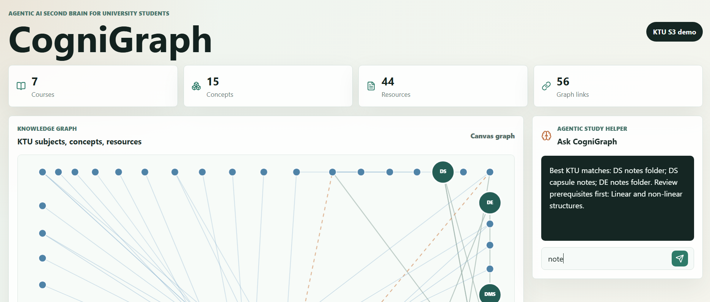
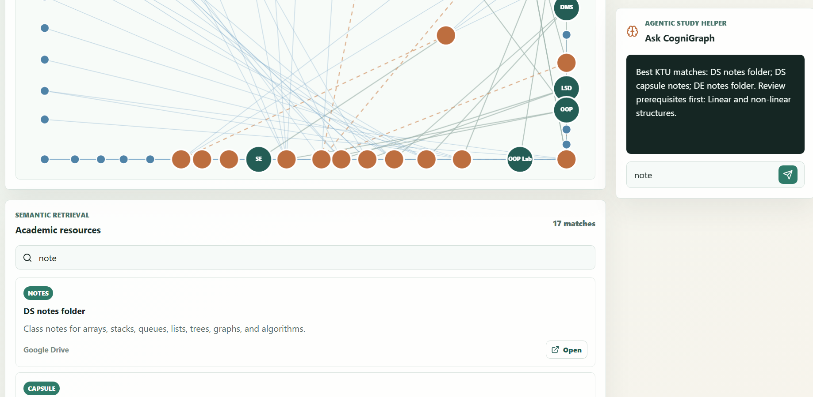

# CogniGraph

KTU S3 CSE Second Brain - Agentic AI-powered knowledge graph for university students.

## Demos




## Demo Scope
- **7 Courses:** Data Structures, Design and Engineering, Discrete Mathematical Structures, Logic System Design, Object Oriented Programming Using Java, OOP Lab, Sustainable Engineering
- **44 Resources:** Textbooks, notes, capsules, assignments, programs, practice material, lab material, records, series and university question papers
- **15 Concepts:** With prerequisite chains for knowledge path tracing

## Features
- Knowledge graph with force-directed canvas layout
- Semantic search across resource titles, summaries, types, sources, course codes, and concept names
- Assistant panel with natural-language queries and prerequisite hints
- Dashboard summary cards (courses, concepts, resources, graph links)

## Data Model
- **Course:** subject code, name, semester (KTU S3)
- **Concept:** topic with prerequisite links
- **AcademicResource:** title, type, courseId, conceptIds, summary, source, url

## Search
Token-based matching across resource title, summary, type, source, course code/name/semester, and linked concept names.

## Graph Relationships
- course → concept: `contains`
- prerequisite concept → concept: `prereq`
- concept → resource: `supports`

## Commands
```bash
npm run dev    # development server
npm run lint   # lint check
npm run build  # build
```

## Extension Ideas (KTU CSE Focus)
- Subject and resource-type filters
- Module-level concepts per KTU subject
- File ingestion for PDFs/notes/question papers
- Graph zoom/pan and click-to-filter
- Local persistence for custom resources